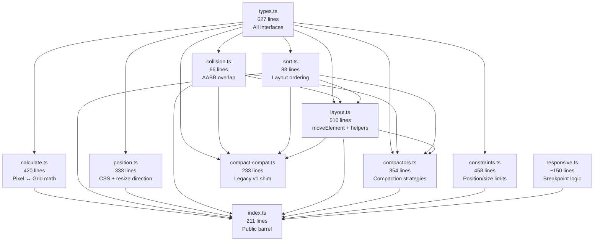

# `src/core/` Decomposition & Architecture Map

> **Scope:** 11 files, ~2,870 lines of pure TypeScript.  
> **Purpose:** The framework-agnostic engine behind react-grid-layout v2.  
> No React imports, no DOM — just math, data structures, and algorithms.

---

## 1. Conceptual Domains

The 11 files decompose into **5 conceptual domains**. Each domain has a single responsibility and a clear dependency direction (no cycles).

```
┌──────────────────────────────────────────────────────────┐
│                       TYPES                              │
│              types.ts  (627 lines)                       │
│  All interfaces, type aliases, default configs.          │
│  ZERO logic. Imported by everything.                     │
└────────────────────────┬─────────────────────────────────┘
                         │ imported by ↓
┌────────────┬───────────┼───────────┬────────────────────┐
│            │           │           │                    │
│   MATH     │  SPATIAL  │  LAYOUT   │  STRATEGIES        │
│            │           │           │                    │
│ calculate  │ collision │ layout    │ compactors         │
│ sort       │           │           │ constraints        │
│ position   │           │           │ compact-compat     │
│            │           │           │                    │
└────────────┴───────────┴───────────┴────────────────────┘
                         │
              ┌──────────┴──────────┐
              │     RESPONSIVE      │
              │   responsive.ts     │
              └─────────────────────┘
                         │
              ┌──────────┴──────────┐
              │     BARREL          │
              │    index.ts         │
              └─────────────────────┘
```

---

## 2. Domain Breakdown

### Domain A: Types (`types.ts`)

| Lines | Exports | Depends on |
|-------|---------|-----------|
| 627 | 31 types, 4 default configs | Nothing |

**Role:** Single source of truth for every data structure in the system.

**Key types for PCD:**

| Type | What it represents | PCD relevance |
|------|-------------------|---------------|
| `LayoutItem` | One widget: `{i, x, y, w, h, minW?, maxW?, minH?, maxH?, static?, moved?}` | The primary data model. PCD's `WidgetConfig` maps to this 1:1. |
| `Layout` | `readonly LayoutItem[]` — immutable array of items | The thing we pass in and get back from every operation. |
| `Compactor` | Interface: `{type, allowOverlap, preventCollision?, compact(layout, cols)}` | PCD uses `getCompactor(null, true, false)` for freeform. |
| `LayoutConstraint` | Plugin interface: `{name, constrainPosition?, constrainSize?}` | Default: `gridBounds + minMaxSize`. PCD could add custom ones. |
| `EventCallback` | `(layout, oldItem, newItem, placeholder, event, element) => void` | Every drag/resize callback follows this signature. |
| `CompactType` | `"vertical" | "horizontal" | "wrap" | null` | PCD uses `null` (no gravity). |

**Configuration types** (v2 composable props):
- `GridConfig` — cols, rowHeight, margin, containerPadding, maxRows
- `DragConfig` — enabled, bounded, handle, cancel, threshold
- `ResizeConfig` — enabled, handles, handleComponent
- `DropConfig` — enabled, defaultItem, onDragOver

---

### Domain B: Math (`calculate.ts`, `sort.ts`, `position.ts`)

These are pure functions with no state, no side effects, no layout mutation.

#### `calculate.ts` — Pixel ↔ Grid Unit Conversion (420 lines)

| Function | Direction | What it does |
|----------|-----------|-------------|
| `calcGridColWidth(params)` | — | Returns single column width in px |
| `calcGridItemWHPx(gridUnits, colOrRow, margin)` | Grid→Px | Grid units → pixel dimension |
| `calcGridItemPosition(params, x, y, w, h, drag?, resize?)` | Grid→Px | Full position: `{top, left, width, height}` in px |
| `calcXY(params, top, left, w, h)` | Px→Grid | Pixels → grid units, **clamped** to bounds |
| `calcXYRaw(params, top, left)` | Px→Grid | Pixels → grid units, **unclamped** |
| `calcWH(params, width, height, x, y, handle)` | Px→Grid | Pixel dimensions → grid units, clamped |
| `calcWHRaw(params, width, height)` | Px→Grid | Pixel dimensions → grid units, unclamped, min 1 |
| `calcGridCellDimensions(config)` | — | Cell metrics for rendering grid backgrounds |
| `clamp(num, min, max)` | — | Utility |

**Key insight:** v2 has paired "clamped" vs "Raw" variants. The clamped versions (`calcXY`, `calcWH`) were used in v1 where boundary enforcement was inline. v2 uses the Raw versions (`calcXYRaw`, `calcWHRaw`) combined with the constraint system for cleaner separation.

**Rounding correction** (lines 135-161): After converting grid→px, there's a rounding fix that adjusts width/height so that margin gaps between adjacent items are pixel-perfect. This only runs when NOT dragging/resizing (to avoid jitter).

#### `sort.ts` — Layout Ordering (83 lines)

| Function | What it does |
|----------|-------------|
| `sortLayoutItems(layout, compactType)` | Dispatches to correct sort based on compact mode |
| `sortLayoutItemsByRowCol(layout)` | Sort by y↑ then x↑ (top-left to bottom-right) |
| `sortLayoutItemsByColRow(layout)` | Sort by x↑ then y↑ (left-to-right, then down) |

**Used by:** compactors (for iteration order) and `moveElement` (for deterministic collision resolution).

**PCD note:** With `compactType=null`, `sortLayoutItems` returns a plain copy (`[...layout]`) — no reordering.

#### `position.ts` — CSS Rendering & Directional Resize (333 lines)

Two responsibilities in one file:

**1. CSS Style Generation (lines 1-79):**

| Function | Output |
|----------|--------|
| `setTransform({top, left, width, height})` | `{transform: "translate(Xpx, Ypx)", width, height}` |
| `setTopLeft({top, left, width, height})` | `{top, left, width, height, position: "absolute"}` |
| `perc(num)` | `"50%"` etc. |

**2. Directional Resize (lines 82-253):**

Handles the geometry of resizing from different edges/corners. When you resize from the **west** edge, the item's `left` decreases as `width` increases. The `resizeItemInDirection(handle, currentSize, newSize, containerWidth)` function dispatches to 8 handler functions:

```
n  → top shifts up, height grows
e  → width grows rightward
s  → height grows downward  
w  → left shifts left, width grows
ne → north + east combined
nw → north + west combined
se → south + east combined
sw → south + west combined
```

Each handler also clamps to prevent negative `left`/`top` and container overflow.

**3. Position Strategies (lines 255-333):**

v2 composable interface for customizing CSS output:

| Strategy | Behavior |
|----------|----------|
| `transformStrategy` | Default. Uses CSS `transform: translate()` |
| `absoluteStrategy` | Uses CSS `top`/`left` |
| `createScaledStrategy(scale)` | For containers inside `transform: scale()` |

---

### Domain C: Spatial (`collision.ts`)

#### `collision.ts` — AABB Overlap Detection (66 lines)

The smallest and most critical file. Three functions:

```typescript
collides(l1, l2): boolean       // Do two items overlap? (AABB check)
getFirstCollision(layout, item) // First item that overlaps (or undefined)
getAllCollisions(layout, item)   // All items that overlap (array)
```

**The AABB formula (Axis-Aligned Bounding Box):**
```
No collision if:
  l1.x + l1.w <= l2.x   (l1 entirely left of l2)
  l1.x >= l2.x + l2.w   (l1 entirely right of l2)
  l1.y + l1.h <= l2.y   (l1 entirely above l2)
  l1.y >= l2.y + l2.h   (l1 entirely below l2)

Collision = NOT any of the above
```

**No edge-touching:** Items that share an edge (e.g., item at x=0, w=3 and item at x=3) do NOT collide. The `<=` operators ensure adjacent items are non-overlapping. This is important for PCD's gutter handles which detect shared edges.

**PCD usage:** `getAllCollisions` is imported directly by `DashboardLayout.tsx` (line 27) and used in `handleDrag` and `handleDragStop` to detect when the dragged widget overlaps another.

---

### Domain D: Layout (`layout.ts`)

#### `layout.ts` — Layout Mutation & Collision Resolution (510 lines)

The highest-complexity file. Contains all functions that **mutate** layout item positions.

**Query functions (read-only):**

| Function | What it does |
|----------|-------------|
| `bottom(layout)` | Returns highest y+h in the layout (for container height) |
| `getLayoutItem(layout, id)` | Find item by `id` |
| `getStatics(layout)` | Filter to `static=true` items |
| `validateLayout(layout, contextName)` | Dev-only check for duplicate keys, missing fields |

**Clone functions (immutable helpers):**

| Function | What it does |
|----------|-------------|
| `cloneLayoutItem(item)` | Shallow clone with `moved=false` |
| `cloneLayout(layout)` | Clone array + each item |

**Modification functions:**

| Function | What it does | Mutates? |
|----------|-------------|----------|
| `modifyLayout(layout, id, fn)` | Apply transform fn to one item, return new array | No (returns new array) |
| `withLayoutItem(layout, id, fn)` | Like modifyLayout but returns `[newLayout, modifiedItem]` | No |
| `correctBounds(layout, cols)` | Clamp all items to `cols` boundary, fix width | **Yes** (mutates items) |

**The Big Two — Movement & Collision Resolution:**

#### `moveElement(layout, item, x, y, isUserAction, preventCollision, compactType, cols, allowOverlap)` (line 270-340)

The primary function called by `GridLayout.onDrag` and `GridLayout.onDragStop`.

```
1. Sort layout by compactType order
2. Set item.x = x, item.y = y, item.moved = true  (MUTATION)
3. Check collisions: getAllCollisions(sorted, item)
4. Branch:
   ├── allowOverlap=true && collision?
   │   → cloneLayout and return (items stack, no push)
   ├── preventCollision=true && collision?
   │   → REVERT item.x, item.y to old values, return SAME reference
   └── else (normal mode):
       → For each collision:
           moveElementAwayFromCollision(layout, item, collision, ...)
```

**Subtlety #1:** When `allowOverlap=true` and there's a collision, `moveElement` returns a **cloned** layout. When there's NO collision with `allowOverlap`, it returns the original (mutated) reference. PCD's engine can detect "something changed" by comparing references.

**Subtlety #2:** When `preventCollision=true`, the function reverts and returns the **SAME reference** as input. This is how RGL signals "move rejected."

#### `moveElementAwayFromCollision(layout, collider, itemToMove, compactType, cols, preventCollision)` (line 347-433)

The recursive collision resolver used by `moveElement`.

```
1. If itemToMove is static → do nothing
2. Determine if collision is "fake" (items not actually touching after sorting)
3. Try moving itemToMove to just below/right of collider
4. If that causes new collisions → recurse
5. If recursion fails → try alternative direction
```

**Optimization (line 372-385):** Before pushing an item, the function checks if sorting alone resolves the overlap. If two items are at the same y-position, sorting by row-col might separate them.

**PCD note:** With `allowOverlap=true`, `moveElementAwayFromCollision` is **never called** during drag. PCD handles collision resolution entirely outside RGL via `trySwap` and `resolveResizeCollisions`.

---

### Domain E: Strategies (`compactors.ts`, `constraints.ts`, `compact-compat.ts`)

#### `compactors.ts` — Compaction Algorithms (354 lines)

The pluggable compaction system. v2's key architectural innovation.

**Factory function:**
```typescript
getCompactor(type: CompactType, allowOverlap?: boolean, preventCollision?: boolean): Compactor
```

**6 built-in compactors:**

| Compactor | type | allowOverlap | preventCollision | compact() behavior |
|-----------|------|-------------|-------------------|-------------------|
| `verticalCompactor` | "vertical" | false | false | Items float up to fill gaps |
| `horizontalCompactor` | "horizontal" | false | false | Items float left to fill gaps |
| `noCompactor` | null | false | false | Passthrough (clone only) |
| `verticalOverlapCompactor` | "vertical" | **true** | false | Passthrough (skip compaction) |
| `horizontalOverlapCompactor` | "horizontal" | **true** | false | Passthrough |
| `noOverlapCompactor` | null | **true** | false | Passthrough |

**When preventCollision=true:** A wrapper compactor is created that delegates `compact()` to the base compactor but has `preventCollision=true` in its interface. The `compact()` logic itself doesn't change — `preventCollision` is read by `moveElement` in layout.ts, not by the compactor.

**Key functions inside compactors.ts:**

| Function | Used by |
|----------|---------|
| `compactItemVertical(compareWith, item, sorted, bottom)` | verticalCompactor |
| `compactItemHorizontal(compareWith, item, sorted, cols)` | horizontalCompactor |
| `resolveCompactionCollision(layout, item, moveToCoord, axis)` | Both compact functions |

**PCD uses:** `getCompactor(null, true, false)` → returns `noOverlapCompactor` with `preventCollision=false`. This means:
- `compact()` is a passthrough (clone only)
- `moveElement` allows overlaps (items stack, no push)
- No automatic collision resolution at all

#### `constraints.ts` — Position/Size Limiting (458 lines)

Documented fully in [02-constraint-system.md](02-constraint-system.md).

**Summary:** Composable plugin functions that run in GridItem (before layout update) to clamp position and size to valid ranges. Default: `[gridBounds, minMaxSize]`.

#### `compact-compat.ts` — Legacy v1 Algorithm (233 lines)

A backwards-compatibility shim that implements the exact v1 `compact()` and `compactItem()` functions. 

**PCD relevance: NONE.** This file is not exported by `index.ts` and is not used by v2 internally. The comment on line 136 of index.ts explicitly notes: "Note: compact and compactItem are NOT exported (#2213)."

**Can be ignored entirely.**

---

## 3. Dependency Graph



**No cycles.** The dependency direction is strictly:
```
types → {math, spatial} → {layout} → {strategies} → index
```

---

## 4. File-by-File Statistics

| File | Lines | Bytes | Functions | Types | Domain | PCD Uses? |
|------|-------|-------|-----------|-------|--------|----------|
| `types.ts` | 627 | 16,923 | 0 | 31 | Types | ✅ LayoutItem, Layout, Compactor, EventCallback |
| `calculate.ts` | 420 | 13,292 | 9 | 3 | Math | ❌ (used internally by GridItem) |
| `sort.ts` | 83 | 2,320 | 3 | 0 | Math | ❌ (used internally by compactors/layout) |
| `position.ts` | 333 | 8,491 | 12 | 0 | Math | ❌ (used internally by GridItem) |
| `collision.ts` | 66 | 1,967 | 3 | 0 | Spatial | ✅ `getAllCollisions` in DashboardLayout |
| `layout.ts` | 510 | 14,963 | 12 | 0 | Layout | ❌ (used internally by GridLayout) |
| `compactors.ts` | 354 | 11,156 | 8 | 0 | Strategies | ✅ `getCompactor` in DashboardLayout |
| `constraints.ts` | 458 | 13,106 | 9 | 0 | Strategies | ❌ (defaults used internally) |
| `compact-compat.ts` | 233 | 7,183 | 4 | 0 | Legacy | ❌ Dead code |
| `responsive.ts` | ~150 | 6,280 | 5 | 0 | Responsive | ❌ PCD uses GridLayout directly |
| `index.ts` | 211 | 4,807 | 0 | 0 | Barrel | ✅ All public imports |
| **TOTAL** | **~2,870** | **~100K** | **~65** | **31** | | |

---

## 5. Call-Stack Map: "What calls what?"

### During a Drag Operation

```
GridItem.onDrag()
  ├── calcXYRaw(positionParams, top, left)                    [calculate.ts]
  ├── applyPositionConstraints(constraints, item, x, y, ctx)  [constraints.ts]
  │   ├── gridBounds.constrainPosition()                      [constraints.ts]
  │   └── minMaxSize (no constrainPosition)                   [constraints.ts]
  └── calls GridLayout.onDrag(i, x, y, data)
        ├── moveElement(layout, item, x, y, ...)              [layout.ts]
        │   ├── sortLayoutItems(layout, compactType)           [sort.ts]
        │   ├── getAllCollisions(sorted, item)                  [collision.ts]
        │   │   └── collides(item, other) per each item        [collision.ts]
        │   └── (if allowOverlap): cloneLayout                 [layout.ts]
        ├── compactor.compact(newLayout, cols)                  [compactors.ts]
        │   └── (noOverlapCompactor): cloneLayout              [layout.ts]
        └── fires onDragProp callback
              └── PCD handleDrag()
                    ├── mergeConstraints(newLayout, layout)     [DashboardLayout]
                    ├── getAllCollisions(layout, dragged)        [collision.ts]
                    └── trySwap(layout, id, dragSlot)            [swapEngine.ts]
```

### During a Resize Operation

```
GridItem.onResizeHandler()
  ├── resizeItemInDirection(handle, current, new, width)       [position.ts]
  ├── calcWHRaw(positionParams, width, height)                 [calculate.ts]
  ├── applySizeConstraints(constraints, item, w, h, handle)    [constraints.ts]
  │   ├── gridBounds.constrainSize()                           [constraints.ts]
  │   └── minMaxSize.constrainSize()                           [constraints.ts]
  └── calls GridLayout.onResize(i, w, h, data)
        ├── withLayoutItem(layout, id, fn)                     [layout.ts]
        ├── moveElement (if directional handle shifted x/y)    [layout.ts]
        ├── compactor.compact(newLayout, cols)                  [compactors.ts]
        └── fires onResizeProp callback
              └── PCD handleResize()
                    ├── mergeConstraints(newLayout, layout)     [DashboardLayout]
                    └── resolveResizeCollisions(...)             [squashPushEngine.ts]
```

---

## 6. Proposed Decomposition Improvements (Observations Only)

These are **observations** about maintainability, not action items:

### A. `position.ts` does two unrelated things
- CSS style generation (`setTransform`, `setTopLeft`, `perc`)
- Directional resize geometry (`resizeItemInDirection` + 8 handlers)

These could be two files: `css.ts` and `resize-direction.ts`.

### B. `layout.ts` is the "God module" at 510 lines
Contains: queries, cloning, mutation, movement, recursive collision resolution.

Could be split into:
- `layout-queries.ts` — `bottom()`, `getLayoutItem()`, `getStatics()`, `validateLayout()`
- `layout-clone.ts` — `cloneLayoutItem()`, `cloneLayout()`, `modifyLayout()`, `withLayoutItem()`
- `layout-move.ts` — `moveElement()`, `moveElementAwayFromCollision()`, `correctBounds()`

### C. `compact-compat.ts` is dead weight
Not exported, not used by v2 internals. Could be removed from the fork entirely.

### D. `types.ts` at 627 lines is large but well-organized
Sections are clearly demarcated. No splitting needed — it's already the right shape for a types file.

---

## 7. Navigation Index

| If you need to understand... | Read this file | Focus on... |
|------------------------------|---------------|-------------|
| What a LayoutItem looks like | types.ts | Lines 37-107 |
| How pixel↔grid conversion works | calculate.ts | `calcXYRaw`, `calcWHRaw` |
| How collision detection works | collision.ts | `collides` (11 lines) |
| How drag moves are applied | layout.ts | `moveElement` (lines 270-340) |
| How compaction modes differ | compactors.ts | `getCompactor` factory |
| How constraints limit position/size | constraints.ts | `applyPositionConstraints` |
| How resize direction affects geometry | position.ts | `resizeItemInDirection` |
| How items are sorted for iteration | sort.ts | `sortLayoutItems` |
| What PCD imports from core | index.ts | The barrel re-exports |
| How PCD wires everything together | DashboardLayout.tsx | Lines 119-353 |
