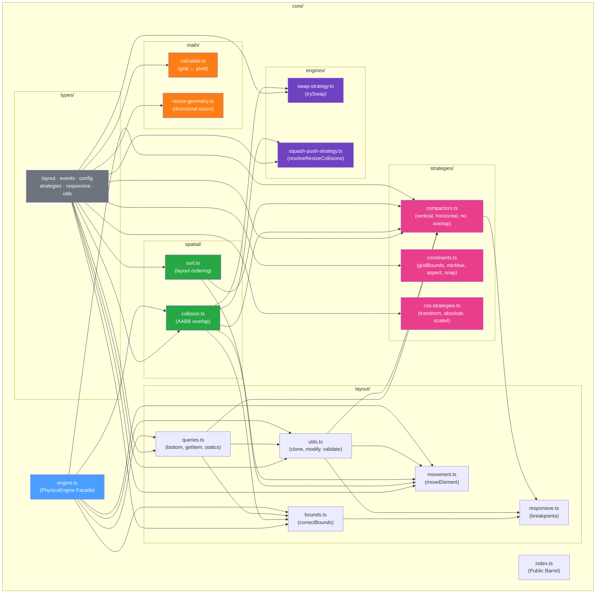
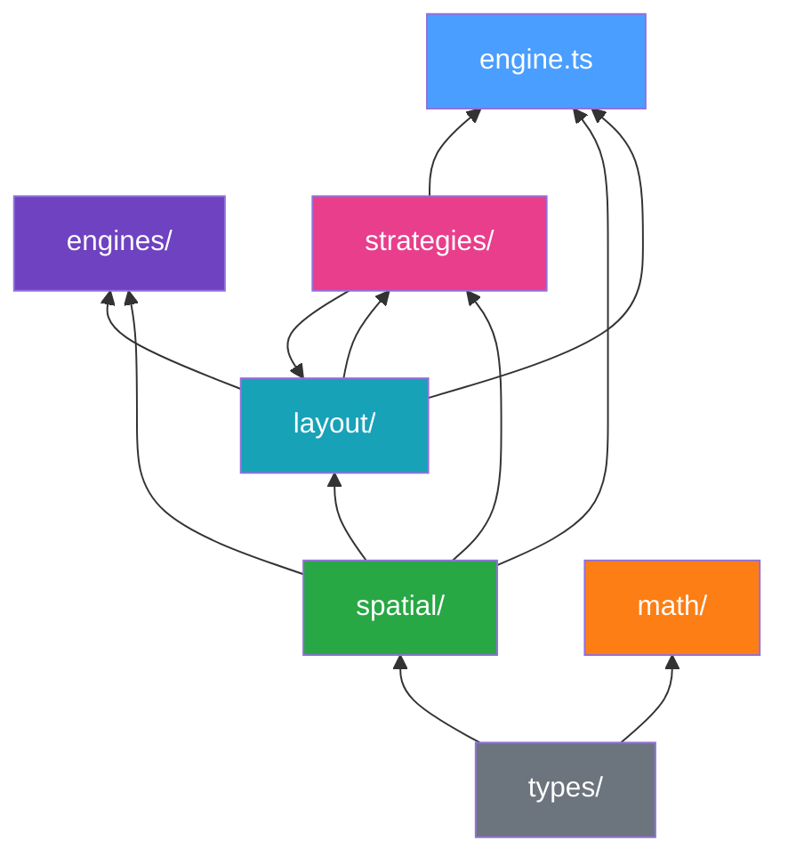
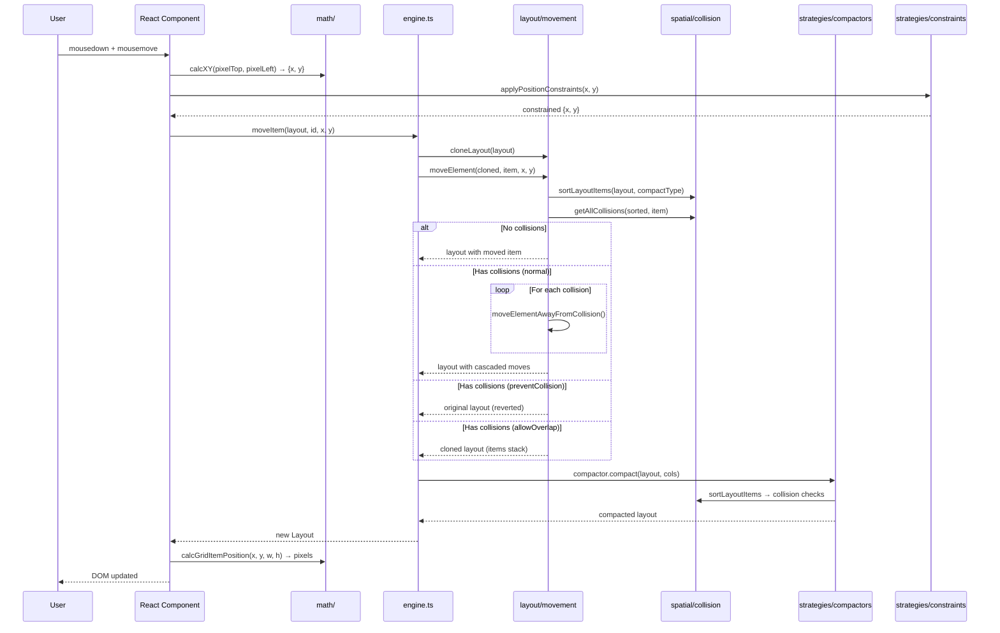
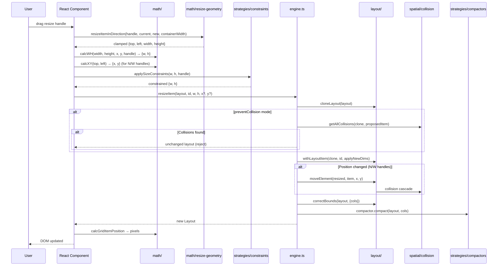
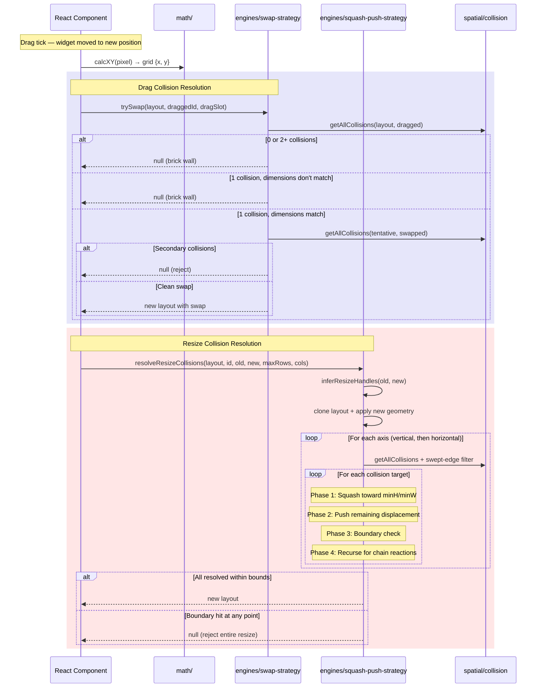
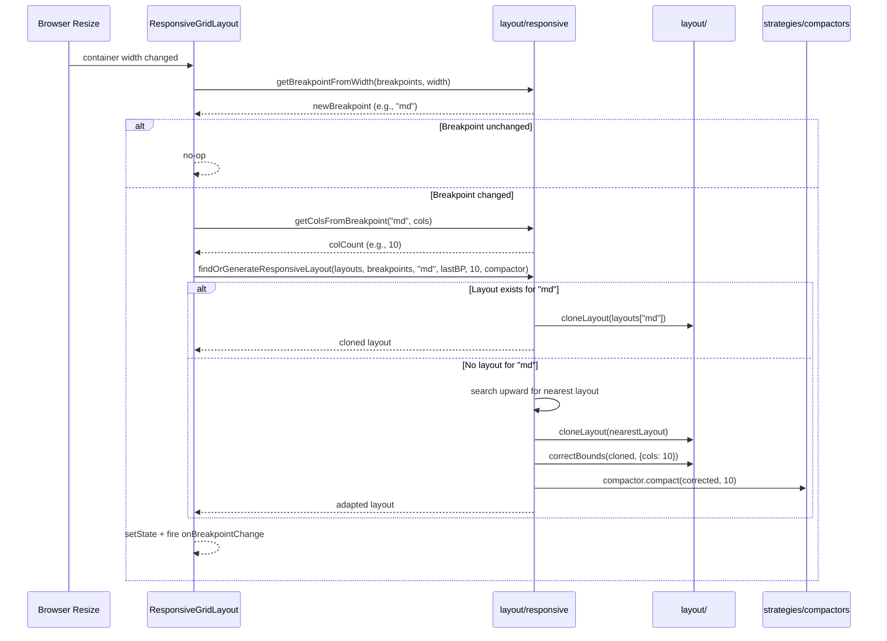
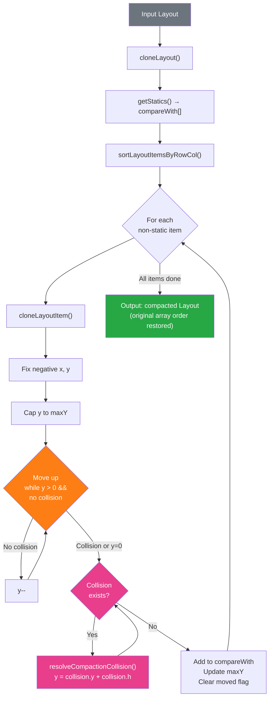
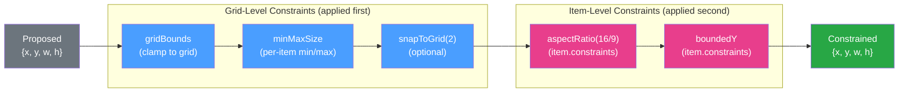
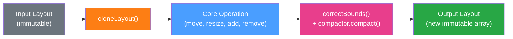

# `core/` — Grid Layout Engine Architecture

> Pure TypeScript layout algorithms and types. No React dependencies — can be used with any framework.

---

## Module Map

---

## Dependency Hierarchy

The modules form a **clean DAG** (directed acyclic graph) with `types` at the root and `engine` at the top:

**Reading bottom-to-top:**
1. **`types/`** — Zero deps. Pure type definitions + default config constants.
2. **`spatial/`** — Depends only on types. AABB collision detection + sorting.
3. **`math/`** — Depends only on types. Grid↔pixel coordinate math.
4. **`layout/`** — Depends on types + spatial. Cloning, queries, bounds, movement.
5. **`strategies/`** — Depends on types + spatial + layout. Compactors, constraints, CSS.
6. **`engines/`** — Depends on types + spatial. Drag swap + resize squash-push.
7. **`engine.ts`** — Depends on layout + spatial + strategies. The PhysicsEngine facade.

---

## Data Flow: Drag Operation

What happens when a user drags a widget from position A to position B:

---

## Data Flow: Resize Operation

What happens when a user resizes a widget by dragging a handle:

---

## Data Flow: Custom Collision Resolution (Swap + Squash-Push)

When the app uses the `CollisionResolver` prop for custom physics:

---

## Data Flow: Responsive Breakpoint Change

What happens when the container width crosses a breakpoint threshold:

---

## Data Flow: Compaction Pipeline

How the vertical compactor processes a layout after any change:

---

## Data Flow: Constraint Pipeline

How position and size constraints are applied during drag/resize:

Each constraint receives the **output of the previous one** — it's a pipeline, not parallel application. Order matters.

---

## The PhysicsEngine Facade

`engine.ts` is the **top-level orchestrator**. It wraps all the lower-level modules into a clean, immutable API. Every method follows the same pattern:

**Immutability invariant**: The input layout is **never** mutated. `cloneLayout()` always runs first.

### PhysicsEngine API

| Method | Pipeline | Description |
|---|---|---|
| `initializeLayout(layout)` | clone → correctBounds → compact | Normalize a raw layout for initial render. |
| `moveItem(layout, id, x, y)` | clone → moveElement → compact | Drag a widget, cascade collisions, compact. |
| `resizeItem(layout, id, w, h, x?, y?)` | clone → collision check → withLayoutItem → moveElement? → correctBounds → compact | Resize a widget with optional reposition. |
| `addItem(layout, item)` | clone → dedup → append → correctBounds → compact | Add a widget (auto-deduplicates by ID). |
| `removeItem(layout, id)` | clone → filter → compact | Remove a widget and fill gaps. |
| `compact(layout)` | clone → correctBounds → compact | Re-compact after manual mutations. |
| `bottom(layout)` | — | Query: highest occupied row. |
| `getItem(layout, id)` | — | Query: find item by ID. |

---

## Subfolder Quick Reference

| Folder | Purpose | Key Exports | README |
|---|---|---|---|
| [`types/`](./types/) | Type definitions & config defaults | `LayoutItem`, `Layout`, `Compactor`, `LayoutConstraint`, `PositionStrategy`, `GridConfig` | [README](./types/README.md) |
| [`spatial/`](./spatial/) | Collision detection & sorting | `collides`, `getAllCollisions`, `getFirstCollision`, `sortLayoutItems` | [README](./spatial/README.md) |
| [`math/`](./math/) | Grid ↔ pixel coordinate math | `calcGridItemPosition`, `calcXY`, `calcWH`, `resizeItemInDirection` | [README](./math/README.md) |
| [`layout/`](./layout/) | Layout manipulation & queries | `cloneLayout`, `moveElement`, `correctBounds`, `bottom`, `findOrGenerateResponsiveLayout` | [README](./layout/README.md) |
| [`strategies/`](./strategies/) | Compactors, constraints, CSS | `verticalCompactor`, `gridBounds`, `applyPositionConstraints`, `transformStrategy` | [README](./strategies/README.md) |
| [`engines/`](./engines/) | Collision resolution strategies | `trySwap`, `resolveResizeCollisions`, `inferResizeHandles` | [README](./engines/README.md) |

---

## Design Principles

### 1. Pure Functions, No Side Effects
Every function in `core/` is a pure function (with explicit exceptions noted in each README). Given the same inputs, you always get the same outputs. This makes the engine testable, predictable, and framework-agnostic.

### 2. Immutability by Default
`Layout` is `readonly LayoutItem[]`. Functions that need to mutate use `Mutable<LayoutItem>` casts and document it clearly. The PhysicsEngine facade enforces the immutability boundary — inputs are never mutated.

### 3. Strategy Pattern Everywhere
Three pluggable strategy families (compactors, constraints, CSS positioning) all follow the same pattern: define an interface in `types/`, provide built-in implementations in `strategies/`, let consumers swap at runtime.

### 4. Composition Over Configuration
Constraints pipeline through in array order. Compactors are selected per-grid. CSS strategies are swappable per-grid. Per-item overrides (`item.constraints`, `item.isDraggable`, etc.) compose with grid-level settings.

### 5. Tree-Shakeability
Each strategy is an independent export. Unused compactors, constraints, and CSS strategies are eliminated by bundlers. The `wrapCompactor` is deliberately in `extras/` to avoid bloating `core/`.
